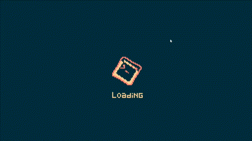

# ShellChat

This project was created with the purpose of learning and experimenting with Godot's network (more specifically using the ENet implementation), so I could apply and improve what I learned here on another game project.

Code and art done by me, while the sounds were made by: Juhani Junkala (Essential Retro Video Game SFX), Fesliyan Studios (keyboard button clicks), Freesfx (mouse click), and Yacoob (Windows 8 bit sounds).

---

